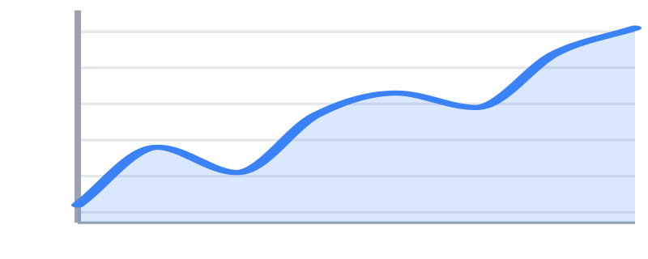
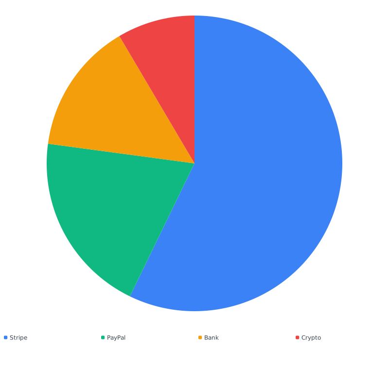
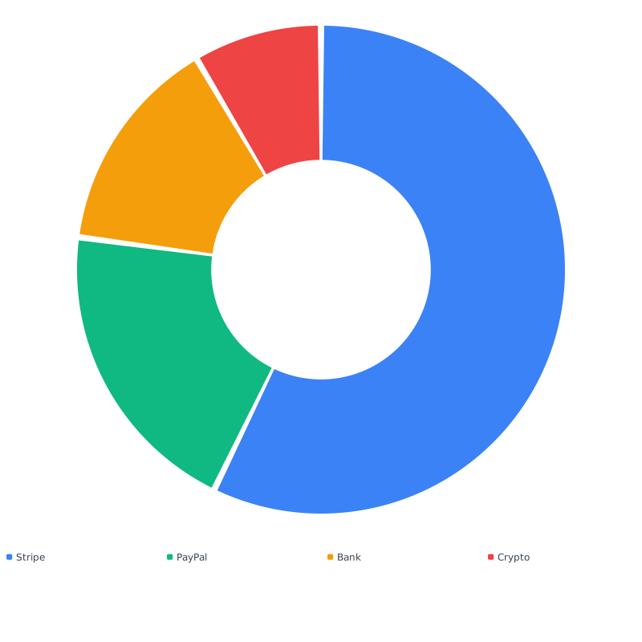

# svgraph

JavaScript-free SVG chart rendering for PHP. Sparkline, line/area, bar,
pie/donut, and progress charts as static markup — no canvas, no JS, no
build step.



- Server-side: charts render to plain SVG strings, ready to echo into a template.
- Zero JavaScript: hover tooltips, keyboard focus, and animations are pure CSS.
- Themeable: built-in light/dark themes plus a full set of CSS custom properties.
- Accessible: native `<title>` tooltips, focusable points, link safety, reduced-motion aware.
- Tiny: PSR-4, no runtime dependencies.

## Requirements

- PHP 8.3+

## Installation

```bash
composer require noeka/svgraph
```

## Quick start

```php
use Noeka\Svgraph\Chart;

echo Chart::line([
    ['Mon', 12], ['Tue', 27], ['Wed', 18], ['Thu', 41],
])->axes()->grid()->smooth()->stroke('#3b82f6');
```

Every chart is `Stringable` — cast with `(string)` or drop directly
into a template with `<?= ?>`.

## Chart gallery

| | | |
|---|---|---|
| **[Sparkline](docs/charts/sparkline.md)**<br> | **[Line / area](docs/charts/line.md)**<br> | **[Bar](docs/charts/bar.md)**<br> |
| **[Pie](docs/charts/pie.md)**<br> | **[Donut](docs/charts/donut.md)**<br> | **[Progress](docs/charts/progress.md)**<br> |

Click any chart for its full options reference and worked examples.

## Theming

```php
use Noeka\Svgraph\Theme;

// Built-in dark theme
Chart::line($data)->theme(Theme::dark());

// Custom palette on top of the default theme
Chart::pie($data)->theme(
    Theme::default()->withPalette('#6366f1', '#f43f5e', '#0ea5e9', '#84cc16'),
);
```

Full reference: [docs/theming.md](docs/theming.md).

## Multi-series

```php
use Noeka\Svgraph\Data\Series;

Chart::line(['Jan' => 12, 'Feb' => 27, 'Mar' => 18])
    ->addSeries(Series::of('Costs', ['Jan' => 6, 'Feb' => 14, 'Mar' => 9], '#ef4444'))
    ->axes()->grid();
```

For bar charts, `->grouped()` and `->stacked()` pick how series share
each x-tick. See [bar chart docs](docs/charts/bar.md#multi-series).

## Legend (toggle series visibility)

```php
Chart::line(['Jan' => 12, 'Feb' => 27, 'Mar' => 18])
    ->addSeries(Series::of('Costs', ['Jan' => 6, 'Feb' => 14, 'Mar' => 9]))
    ->legend();
```

Available on line and bar charts. Each legend entry is a `<label>` bound
to a hidden checkbox; clicking it hides that series and dims the entry.
Pure CSS — no JavaScript.

Caveats:

- **State is page-local.** Refreshing the page resets every toggle; without
  JS there is nowhere to persist it.
- **Axes do not rescale.** Hiding a tall series leaves the value axis at
  the original combined min/max, so the remaining series stay at their
  original positions on the canvas.
- **Multiple charts on the same page** get unique IDs automatically, so
  toggling one chart never affects another.
- **Keyboard-accessible.** The `<label>` + checkbox combo is natively
  focusable; pressing Space toggles the series.

## Animations

```php
Chart::pie($data)->legend()->animate();
```

All entrance animations sit inside `@media (prefers-reduced-motion: no-preference)`,
so users who request reduced motion always see a static chart. Details:
[docs/animations.md](docs/animations.md).

## Documentation

- [Getting started](docs/getting-started.md)
- [Data formats](docs/data-formats.md) — every input shape (lists, tuples, maps, `Point`/`Series`/`Slice`/`Link`)
- [Theming](docs/theming.md) — themes, palettes, full token reference
- [Animations](docs/animations.md)
- [Accessibility](docs/accessibility.md)
- [CSS customization](docs/css-customization.md) — `.series-{N}` hooks, `--svgraph-*` properties
- [Recipes](docs/recipes.md) — Blade, Twig, email, caching
- [docs/index.md](docs/index.md) — full table of contents

## Regenerating example images

The SVGs in [`docs/images/`](docs/images/) are generated from the
runnable PHP scripts in [`examples/`](examples/). Rebuild them after a
code change:

```bash
composer docs:images
```

## License

MIT — see [LICENSE](LICENSE).
