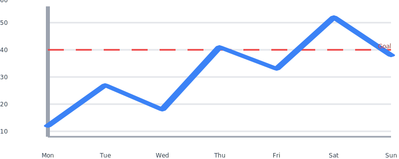
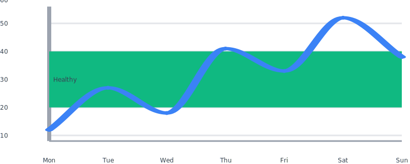
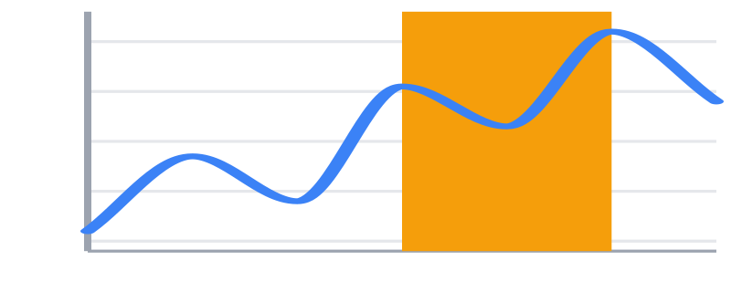
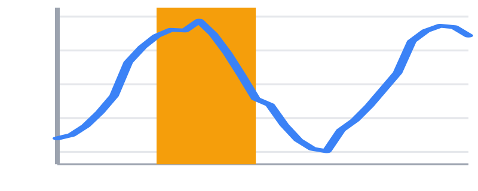
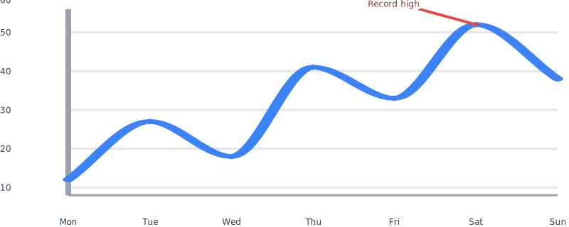
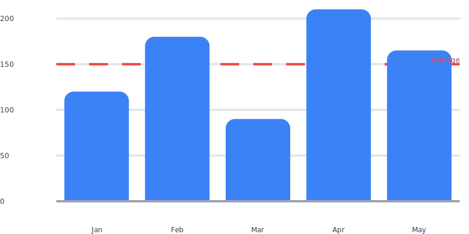
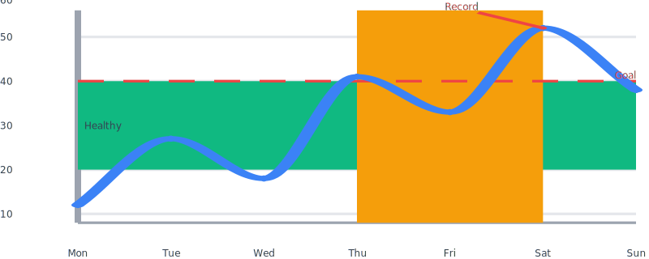

# Annotations

Annotations are overlays that paint analytical context on top of a chart's
plot area — goal lines, healthy ranges, deployment windows, callouts to
specific data points. They live in the `Noeka\Svgraph\Annotations`
namespace and attach to any chart through a single fluent method:

```php
$chart->annotate($annotation);
```

Multiple annotations may be added; they render in insertion order within
their z-layer. Reference lines and bands sit between the grid and the
data marks; callouts sit above the data so leader lines stay legible.

## Quickstart

```php
use Noeka\Svgraph\Annotations\ReferenceLine;
use Noeka\Svgraph\Chart;

Chart::line([
    ['Mon', 12], ['Tue', 27], ['Wed', 18],
    ['Thu', 41], ['Fri', 33], ['Sat', 52], ['Sun', 38],
])
    ->axes()->grid()->points()->stroke('#3b82f6')
    ->annotate(ReferenceLine::y(40)->label('Goal')->color('#ef4444'));
```



## Supported chart types

Annotations render on chart types with a meaningful x/y plot area:

- **Line / Sparkline** — full support, including time axes.
- **Bar (vertical and horizontal)** — y-annotations align with the value
  axis; x-annotations align with the categorical slot index, with
  `x = i` corresponding to the centre of the *i*-th slot.

Pie, donut, and progress charts accept the API call (so generic builder
code stays portable) but silently ignore annotations: there is no plot
area to overlay them on.

## Out-of-range handling

Annotations whose anchor falls outside the visible domain are dropped
silently — they never throw. Bands partially out of range are clipped to
the plot edge so the visible portion still renders. This keeps live
dashboards stable as data shifts under fixed-domain reference values.

## Reference lines

A horizontal or vertical line drawn across the plot area at a fixed
value. Useful for goals, averages, control limits, or "now".

```php
use Noeka\Svgraph\Annotations\ReferenceLine;

ReferenceLine::y(100)->label('Goal');
ReferenceLine::x(5);                              // column index
ReferenceLine::x(new DateTimeImmutable('...'));   // time axis
```

| Method | Default | Description |
|--------|---------|-------------|
| `ReferenceLine::y($value)` | — | Horizontal line at the given y value. |
| `ReferenceLine::x($value)` | — | Vertical line at the given x value. Accepts float (column index) or `DateTimeInterface` (time axis). |
| `->label(string)` | none | Optional text label rendered as an HTML overlay. |
| `->color(string)` | theme `axisColor` | Stroke and label color. |
| `->strokeWidth(float)` | `1.0` | Line stroke width in viewport units. |
| `->dashed(bool = true)` | dashed | Toggle the dashed pattern. |
| `->solid()` | dashed | Shortcut for `->dashed(false)`. |
| `->onAxis(Axis\|string)` | left | Bind a horizontal line to the secondary y-axis (`'right'`/`Axis::Right`). |

The label is anchored to the right end of horizontal lines and the top
of vertical lines. It sits in the wrapper's HTML labels overlay so the
text stays sharp even when the SVG is stretched by the chart's aspect
ratio.

## Threshold bands

A shaded horizontal band between two y values — "healthy range",
tolerance window, control band.

```php
use Noeka\Svgraph\Annotations\ThresholdBand;

ThresholdBand::y(20, 40)->fill('#10b98122')->label('Healthy');
```



| Method | Default | Description |
|--------|---------|-------------|
| `ThresholdBand::y($from, $to)` | — | Band between two y values. Endpoints may be passed in either order. |
| `->fill(string)` | `rgba(120,120,120,0.15)` | Fill color (typically with alpha). |
| `->label(string)` | none | Optional text label centered vertically inside the band. |
| `->onAxis(Axis\|string)` | left | Bind to the secondary y-axis when one is enabled. |

Bands clamp to the plot edges when the band partially overflows the
visible domain — the visible portion still renders. Bands entirely
outside the visible domain are dropped silently.

## Target zones

A shaded vertical band between two x values — deployment window,
incident, holiday, campaign run.

```php
use Noeka\Svgraph\Annotations\TargetZone;

TargetZone::x(3.0, 5.0)->fill('#f59e0b22')->label('Deploy');
```



| Method | Default | Description |
|--------|---------|-------------|
| `TargetZone::x($from, $to)` | — | Vertical band between two x values. Floats (column index) or `DateTimeInterface` (time axis). |
| `->fill(string)` | `rgba(120,120,120,0.15)` | Fill color (typically with alpha). |
| `->label(string)` | none | Optional text label at the top centre of the zone. |

Date endpoints are only valid against a chart in time-axis mode; floats
are only valid against a chart with a regular linear x scale. Mismatched
input is dropped silently — the rest of the chart still renders.

```php
TargetZone::x(
    new DateTimeImmutable('2026-01-08T00:00:00Z'),
    new DateTimeImmutable('2026-01-15T00:00:00Z'),
)->fill('#f59e0b22')->label('Incident');
```



## Callouts

A text + leader-line callout pointing at a specific `(x, y)` coordinate.
Callouts render in the `OverData` z-layer so the leader line and dot
stay above any data marks.

```php
use Noeka\Svgraph\Annotations\Callout;

Callout::at(5, 52, 'Record high')->offset(-10, -8)->color('#ef4444');
```



| Method | Default | Description |
|--------|---------|-------------|
| `Callout::at($x, $y, $text)` | — | Anchor a callout at a data coordinate. `$x` accepts float or `DateTimeInterface`. |
| `->offset(float, float)` | `(6, -6)` | Vector from the anchor to the label end of the leader line, in viewport units. Negative values point left/up. |
| `->color(string)` | theme `axisColor` | Stroke, dot fill, and label color. |
| `->onAxis(Axis\|string)` | left | Resolve `$y` against the secondary y-axis. |

The label-end of the leader line is clamped to the plot area so the
text stays inside the chart even when offsets push it past an edge.
Label alignment follows the offset direction: a leftward offset
right-aligns the label, an upward offset bottom-aligns it.

## Bar charts

`->annotate()` is wired identically into bar charts. On vertical bars,
horizontal reference lines and threshold bands paint across the value
axis; on horizontal bars, vertical reference lines and target zones
paint across the value axis.

```php
use Noeka\Svgraph\Annotations\ReferenceLine;
use Noeka\Svgraph\Chart;

Chart::bar(['Jan' => 120, 'Feb' => 180, 'Mar' => 90, 'Apr' => 210, 'May' => 165])
    ->axes()->grid()->rounded(2)->color('#3b82f6')
    ->annotate(ReferenceLine::y(150)->label('Average')->color('#ef4444'));
```



For x-annotations on bar charts, `x = i` corresponds to the centre of
the *i*-th slot — useful for picking out a specific category with a
`TargetZone::x(i - 0.5, i + 0.5)`.

## Combining annotations

Annotations of different types compose freely. A single chart can carry
a band, a reference line, and a callout simultaneously.

```php
use Noeka\Svgraph\Annotations\Callout;
use Noeka\Svgraph\Annotations\ReferenceLine;
use Noeka\Svgraph\Annotations\TargetZone;
use Noeka\Svgraph\Annotations\ThresholdBand;
use Noeka\Svgraph\Chart;

Chart::line([
    ['Mon', 12], ['Tue', 27], ['Wed', 18],
    ['Thu', 41], ['Fri', 33], ['Sat', 52], ['Sun', 38],
])
    ->axes()->grid()->smooth()->points()->stroke('#3b82f6')
    ->annotate(ThresholdBand::y(20, 40)->fill('#10b98122')->label('Healthy'))
    ->annotate(TargetZone::x(3.0, 5.0)->fill('#f59e0b18'))
    ->annotate(ReferenceLine::y(40)->label('Goal')->color('#ef4444'))
    ->annotate(Callout::at(5, 52, 'Record')->offset(-10, -6)->color('#ef4444'));
```



## Z-order

Annotations sit on the `BehindData` layer by default — between the grid
and the data marks. Callouts sit on the `OverData` layer so leader
lines and dots stay above the data. The order is fixed:

1. Grid lines
2. Annotations on `BehindData` (in insertion order)
3. Data series
4. Annotations on `OverData` (in insertion order)
5. Axes and tick labels
6. Annotation labels (HTML overlay)

## Building custom annotations

Every annotation type extends `Noeka\Svgraph\Annotations\Annotation`,
which exposes two methods to override:

```php
abstract class Annotation
{
    public function layer(): AnnotationLayer       // BehindData by default
    abstract public function render(AnnotationContext $context): string;
    public function labels(AnnotationContext $context): array;
}
```

`AnnotationContext` carries the viewport, theme, and the chart's scales
(linear, log, or time). `render()` returns SVG markup; `labels()` returns
a list of `Svg\Label` value objects positioned via percentages of the
wrapper. Both helpers should return empty values when the annotation's
anchor falls outside the visible domain so the chart degrades gracefully.

## Related

- [Line / area](charts/line.md) — built-in chart that hosts annotations
- [Bar](charts/bar.md) — also supports annotations
- [Theming](theming.md)
- [Data formats](data-formats.md)
