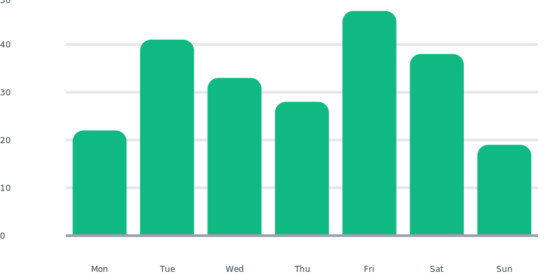
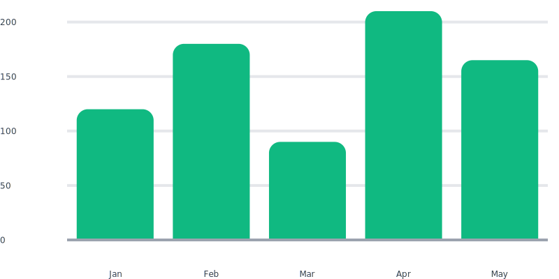
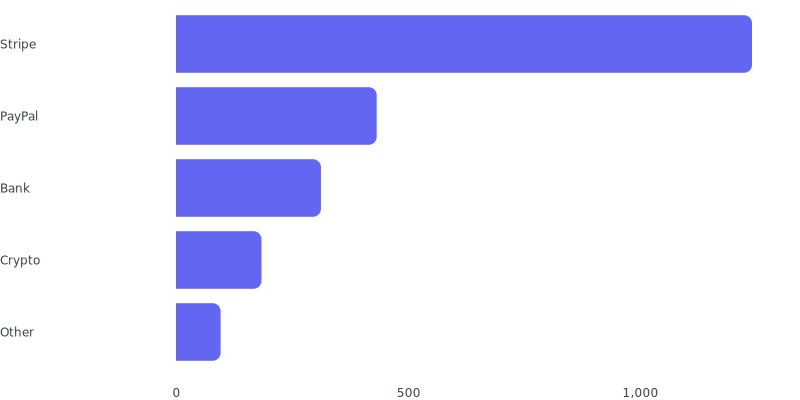
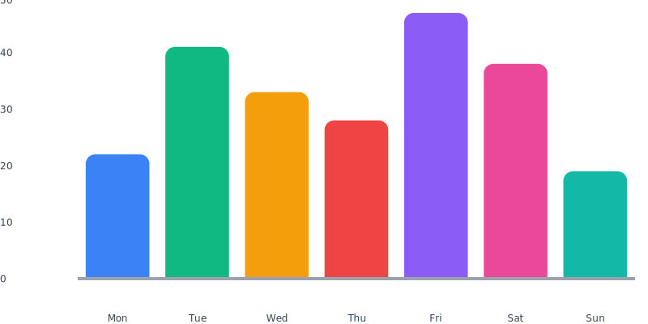
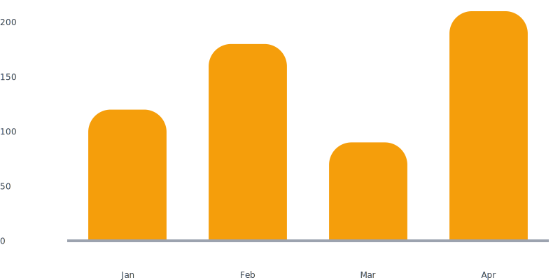
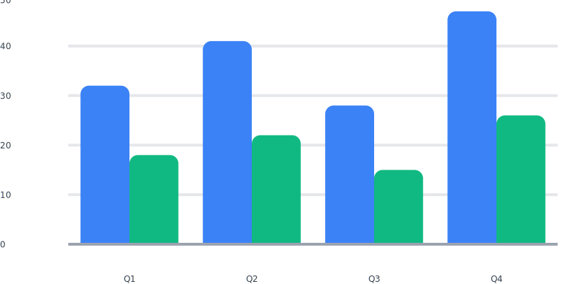
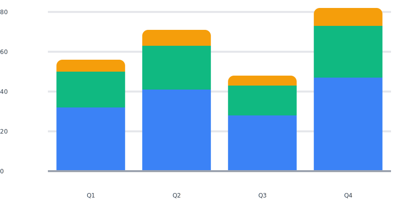

# Bar

Vertical or horizontal bar charts. Multi-series bars can be grouped
(side-by-side) or stacked (cumulative).



## Quickstart

```php
use Noeka\Svgraph\Chart;

echo Chart::bar(['Jan' => 120, 'Feb' => 180, 'Mar' => 90, 'Apr' => 210, 'May' => 165])
    ->axes()->grid()->rounded(2)->color('#10b981');
```



## Accepted data

Bar charts accept every shape from [Data formats](../data-formats.md).
Multi-series via [`addSeries()`](#multi-series).

Negative values are supported — bars grow downward (vertical) or
leftward (horizontal) from the zero baseline.

## Options

| Method | Default | Description |
|--------|---------|-------------|
| `->data($data)` | `[]` | Primary series. |
| `->addSeries(Series)` | — | Append a series for multi-series charts. |
| `->color(string)` | theme fill | Single fill color for series 0. |
| `->rainbow(bool = true)` | `false` | Color each bar from the theme palette (single-series only). |
| `->horizontal(bool = true)` | `false` | Render bars horizontally. |
| `->gap(float)` | `0.2` | Gap between bars as a fraction of slot width. Clamped to 0.0–0.9. |
| `->rounded(float)` | `0.0` | Corner radius in viewBox units. |
| `->grouped(bool = true)` | auto | Place bars side-by-side per slot (default for multi-series). |
| `->stacked(bool = true)` | off | Stack bars; y-axis grows to the cumulative max. |
| `->axes(bool = true)` | `false` | Show axis line and tick labels. |
| `->grid(bool = true)` | `false` | Show grid lines. |
| `->ticks(int)` | `5` | Number of value-axis ticks (clamped to ≥ 2). |
| `->aspect(float)` | `2.0` | Width-to-height ratio. |
| `->cssClass(?string)` | `null` | Extra class on the wrapper. |
| `->theme(Theme)` | `Theme::default()` | Theme tokens. |
| `->animate(bool = true)` | `false` | Bars grow from baseline / axis on entrance. |

## Horizontal

Bars run from the y-axis to the right (or left, for negative values).
Slot labels sit on the left.

```php
Chart::bar([
    'Stripe'  => 1240,
    'PayPal'  => 432,
    'Bank'    => 312,
    'Crypto'  => 184,
    'Other'   => 96,
])->horizontal()->axes()->rounded(1)->color('#6366f1');
```



## Rainbow

Color each bar from the theme palette. Only takes effect for
single-series charts — multi-series charts already pick a per-series
color from the palette.

```php
Chart::bar([
    'Mon' => 22, 'Tue' => 41, 'Wed' => 33, 'Thu' => 28,
    'Fri' => 47, 'Sat' => 38, 'Sun' => 19,
])->rainbow()->axes()->rounded(1.5);
```



## Rounded corners and gap

`rounded()` takes a corner radius in viewBox units (the chart is 100
units wide internally). `gap()` is the inter-bar gap as a fraction of
slot width — `0.0` means bars touch, `0.5` means half the slot is empty.

```php
Chart::bar(['Jan' => 120, 'Feb' => 180, 'Mar' => 90, 'Apr' => 210])
    ->axes()->rounded(4)->color('#f59e0b')->gap(0.35);
```



## Multi-series

### Grouped (default)

Bars sit side-by-side within each slot.

```php
use Noeka\Svgraph\Data\Series;

Chart::bar(['Q1' => 32, 'Q2' => 41, 'Q3' => 28, 'Q4' => 47])
    ->addSeries(Series::of('Costs', ['Q1' => 18, 'Q2' => 22, 'Q3' => 15, 'Q4' => 26]))
    ->grouped()
    ->axes()->grid()->rounded(1.5);
```



### Stacked

Bars stack atop each other; the value axis grows to the cumulative max.

```php
Chart::bar(['Q1' => 32, 'Q2' => 41, 'Q3' => 28, 'Q4' => 47])
    ->addSeries(Series::of('Costs', ['Q1' => 18, 'Q2' => 22, 'Q3' => 15, 'Q4' => 26]))
    ->addSeries(Series::of('Tax',   ['Q1' => 6,  'Q2' => 8,  'Q3' => 5,  'Q4' => 9]))
    ->stacked()
    ->axes()->grid()->rounded(1.5);
```



In stacked mode, positive and negative values stack independently —
positives grow up from zero, negatives down — so a series with mixed
signs renders cleanly.

## Annotations

Reference lines and threshold bands work on bar charts too — useful for
"average" or "target" markers above a categorical x axis. Attach via
`->annotate()`:

```php
use Noeka\Svgraph\Annotations\ReferenceLine;

Chart::bar(['Jan' => 120, 'Feb' => 180, 'Mar' => 90, 'Apr' => 210, 'May' => 165])
    ->axes()->grid()->rounded(2)->color('#3b82f6')
    ->annotate(ReferenceLine::y(150)->label('Average')->color('#ef4444'));
```

See [Annotations](../annotations.md) for the full reference.

## Color resolution

For a given series, the package picks a color in this order:

1. The `Series` instance's `color`.
2. For series 0 only: the chart-level `->color('#hex')`.
3. The theme palette at `index % count(palette)`.

`->rainbow()` overrides this for single-series charts only.

## Notes

- Each bar carries a `series-{N}` class so external CSS can target
  individual series.
- The value axis always includes zero — even if all values are positive,
  the axis starts at 0 (not the data minimum).
- `gap()` is clamped to the range 0.0–0.9; values outside are clamped
  silently.
- Animation staggers bars in render order at 80 ms each.

## Related

- [Theming](../theming.md)
- [Animations](../animations.md)
- [Accessibility](../accessibility.md)
