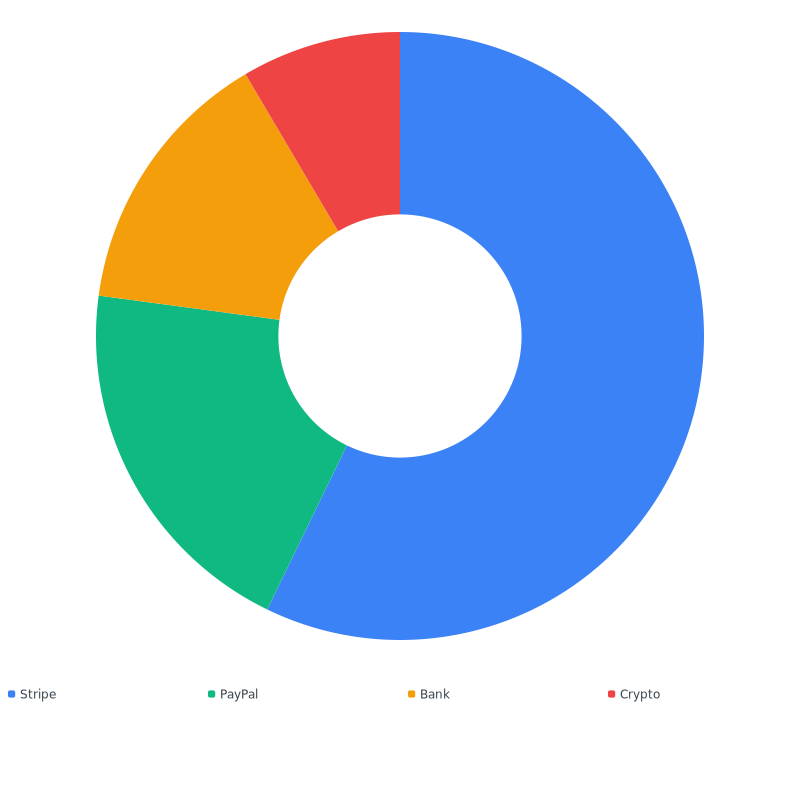
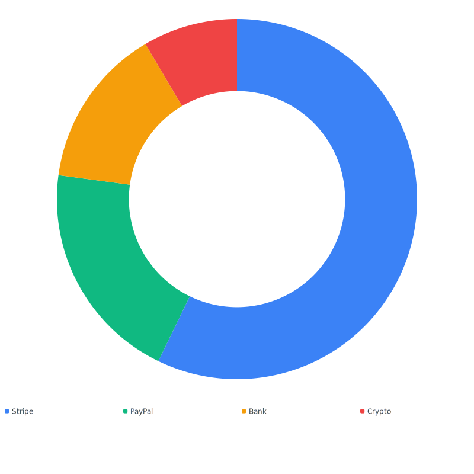

# Donut

A donut chart is a [pie chart](pie.md) with a hollow center. It extends
`PieChart`, so every option on the pie page is also available — the
only addition is a non-zero default `thickness`.


## Quickstart

```php
use Noeka\Svgraph\Chart;

echo Chart::donut([
    'Stripe' => 1240,
    'PayPal' => 432,
    'Bank'   => 312,
    'Crypto' => 184,
])->legend();
```



## Options

Donut accepts every option on [`PieChart`](pie.md#options) — `data()`,
`thickness()`, `gap()`, `startAngle()`, `legend()`, `aspect()`,
`cssClass()`, `theme()`, `animate()`.

The only difference from `PieChart`: `thickness` defaults to `0.4`
instead of `0.0`.

## Adjusting thickness

`thickness` is the inner radius as a fraction of the outer radius:

- `0.0` — solid pie (no hole)
- `0.4` — typical donut (the default for `Chart::donut()`)
- `0.6` — thinner ring
- `0.95` — hairline

Values are clamped to the range 0.0–0.95.

```php
Chart::donut([
    'Stripe' => 1240,
    'PayPal' => 432,
    'Bank'   => 312,
    'Crypto' => 184,
])->thickness(0.6)->gap(1.5)->legend();
```



## Notes

- `Chart::donut()` is a convenience for `new DonutChart()`. You can
  also build a thin donut from `Chart::pie($data)->thickness(0.4)` —
  the rendered output is identical.
- All accessibility, theming, animation, and CSS notes from the
  [pie page](pie.md) apply unchanged.

## Related

- [Pie chart](pie.md) — full options reference
- [Theming](../theming.md)
