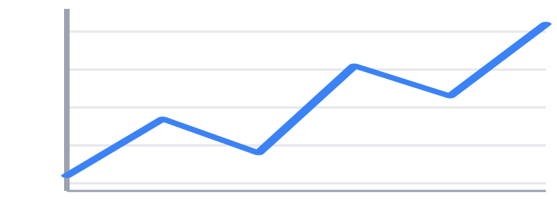
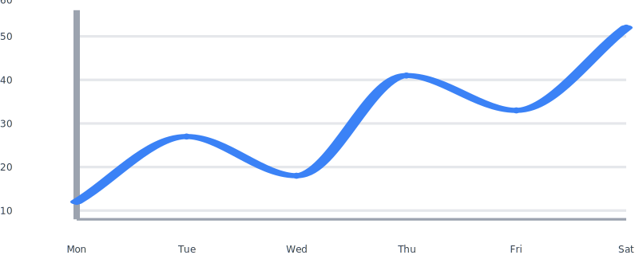
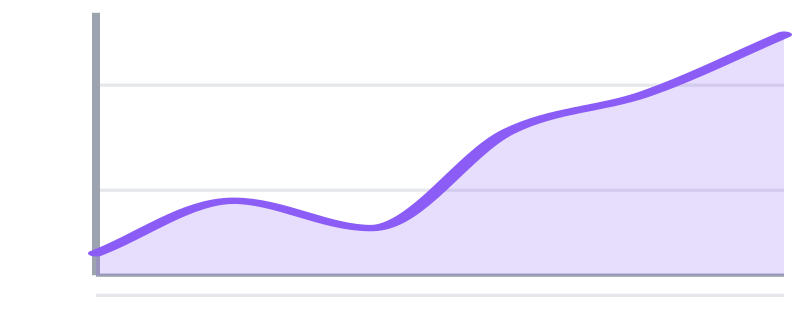
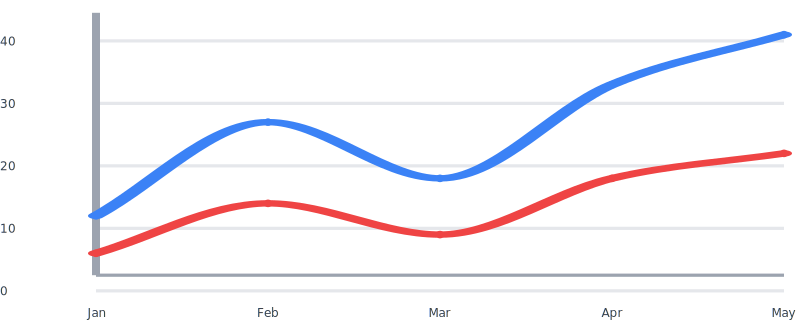
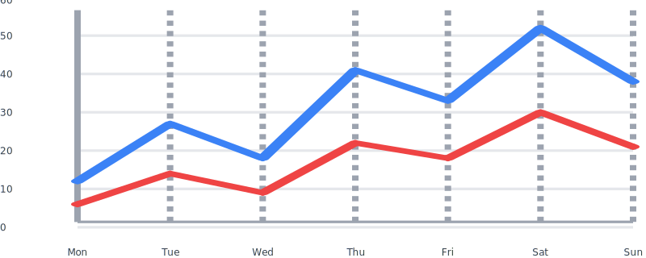
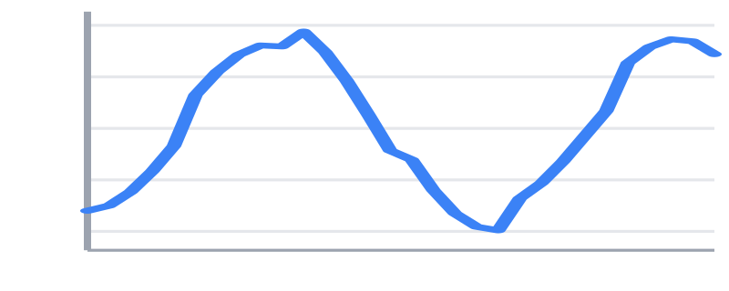
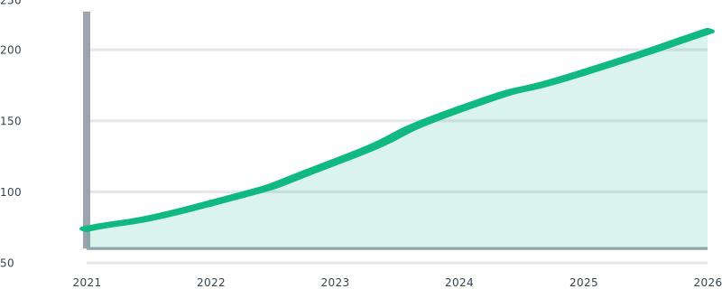
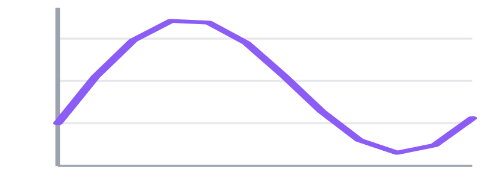
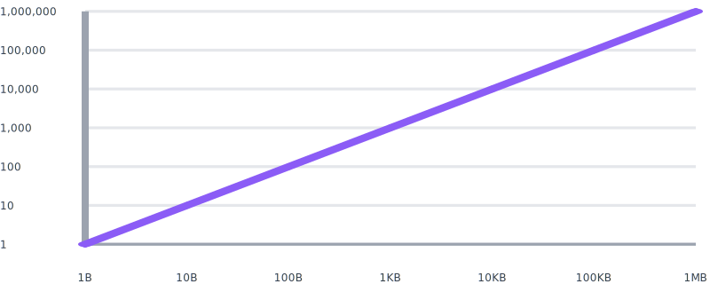
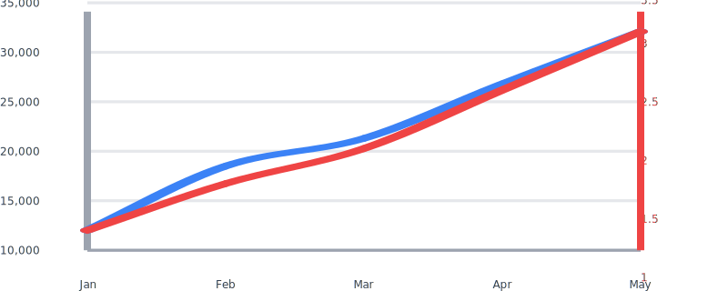

# Line / area

Line charts plot one or more series across a shared x-axis, with optional
smoothing, area fills, axes, grid, and per-point markers.


## Quickstart

```php
use Noeka\Svgraph\Chart;

echo Chart::line([
    ['Mon', 12], ['Tue', 27], ['Wed', 18],
    ['Thu', 41], ['Fri', 33], ['Sat', 52],
])->axes()->grid()->stroke('#3b82f6');
```



## Accepted data

Line charts accept every shape from [Data formats](../data-formats.md):
plain lists, `[label, value]` tuples, label=>value maps, and `Point`
objects. Multi-series via [`addSeries()`](#multi-series).

## Options

| Method | Default | Description |
|--------|---------|-------------|
| `->data($data)` | `[]` | Set the primary series. Replaces any existing data. |
| `->series($data)` | `[]` | Alias of `data()`. |
| `->addSeries(Series)` | — | Append a series for multi-series charts. |
| `->stroke(color, ?width)` | theme stroke | Line color (and optional width) for series 0. |
| `->strokeWidth(float)` | theme value | Stroke width (viewBox units). |
| `->fillBelow(?color, opacity = 0.15)` | off | Shade the area under the line. Pass `null` color to use the stroke color. |
| `->smooth(bool = true)` | `false` | Cubic-Bezier smoothing. |
| `->axes(bool = true)` | `false` | Show y/x axis lines and tick labels. |
| `->grid(bool = true)` | `false` | Show horizontal grid lines. |
| `->points(bool = true)` | `false` | Render a marker dot at each data point. |
| `->crosshair(bool = true)` | `false` | Hover crosshair: vertical guide + multi-series tooltip on the nearest x. |
| `->ticks(int)` | `5` | Number of y-axis ticks (clamped to ≥ 2). Also drives x-axis tick density when `timeAxis()` is on. |
| `->timeAxis(?locale, ?tz, ?format)` | off | Treat point x-values as `DateTimeImmutable` and render a locale-aware time x-axis. See [Time / date axis](#time--date-axis). |
| `->logScale(base = 10, axis = 'left')` | linear | Plot the chosen Y axis on a logarithmic scale. See [Log scale](#log-scale). |
| `->secondaryAxis(?Scale)` | off | Enable a second Y axis on the right edge for series flagged with `Series::onAxis('right')`. See [Dual Y axis](#dual-y-axis). |
| `->aspect(float)` | `2.5` | Width-to-height ratio. |
| `->cssClass(?string)` | `null` | Extra class on the wrapper. |
| `->theme(Theme)` | `Theme::default()` | Colors, typography, hover styling. |
| `->animate(bool = true)` | `false` | Draw-on entrance animation. |

## Smooth + points

Add markers at each data point and smooth the line with cubic Bezier
curves.

```php
Chart::line([
    ['Mon', 12], ['Tue', 27], ['Wed', 18],
    ['Thu', 41], ['Fri', 33], ['Sat', 52],
])->axes()->grid()->smooth()->points()->stroke('#3b82f6');
```



## Filled area

`fillBelow()` shades the area between the line and the chart bottom.
Combine with `smooth()` for a classic area chart.

```php
Chart::line([
    ['Jan', 120], ['Feb', 145], ['Mar', 132],
    ['Apr', 178], ['May', 196], ['Jun', 224],
])->axes()->grid()->smooth()->fillBelow('#8b5cf6', 0.2)->stroke('#8b5cf6');
```



## Multi-series

Append additional series with `addSeries()`. Each series carries its
own optional name and color, and the y-axis auto-extends to fit them
all.

```php
use Noeka\Svgraph\Chart;
use Noeka\Svgraph\Data\Series;

Chart::line(['Jan' => 12, 'Feb' => 27, 'Mar' => 18, 'Apr' => 33, 'May' => 41])
    ->addSeries(Series::of('Costs', ['Jan' => 6, 'Feb' => 14, 'Mar' => 9, 'Apr' => 18, 'May' => 22], '#ef4444'))
    ->axes()->grid()->points()->smooth();
```



Tooltips on multi-series charts prefix the series name, e.g.
`Costs — Mar: 9`.

## Crosshair

Opt in with `->crosshair()` to add a hover-activated vertical guide. Moving
the pointer anywhere along the chart snaps to the nearest x, reveals a
dashed guide line, and opens every series' tooltip stacked at that
column.

```php
use Noeka\Svgraph\Chart;
use Noeka\Svgraph\Data\Series;

Chart::line(['Mon' => 12, 'Tue' => 27, 'Wed' => 18, 'Thu' => 41, 'Fri' => 33, 'Sat' => 52, 'Sun' => 38])
    ->addSeries(Series::of('Costs', ['Mon' => 6, 'Tue' => 14, 'Wed' => 9, 'Thu' => 22, 'Fri' => 18, 'Sat' => 30, 'Sun' => 21], '#ef4444'))
    ->axes()->grid()->points()->crosshair();
```



The image above is a static rendering — open it in a browser via the live
example to see the column hover effect.

Notes:

- Pure CSS; works with the same `:has(...)` support that powers tooltips.
  Browsers without `:has()` show the chart without the column hover (the
  rest of the chart still works).
- Implies marker emission. If `->points()` isn't also enabled, markers
  stay invisible until a column is hovered, then fade in for that column
  only.
- Keyboard users get the same effect: tabbing onto a marker opens its
  column.
- Sparkline charts inherit this method but axes/grid normally aren't on
  sparklines, so the experience is best on full line charts.

## Time / date axis

Pass `DateTimeImmutable` objects as the x-values of your tuples and call
`->timeAxis()` to render a time-aware x-axis. Points are positioned by
time across the plot area (not by index), so unevenly-spaced timestamps
plot at their true relative distance.

```php
use Noeka\Svgraph\Chart;

$base = new DateTimeImmutable('2026-01-01T00:00:00Z');
$points = [];
for ($i = 0; $i < 30; $i++) {
    $points[] = [$base->modify("+{$i} days"), 100 + sin($i / 3) * 6];
}

Chart::line($points)
    ->axes()->grid()
    ->timeAxis(tz: 'UTC')
    ->stroke('#3b82f6');
```



The tick interval auto-selects across **seconds → minutes → hours → days
→ months → years** based on the range and the `->ticks()` count. A
five-year span lands on years; a 30-day span on days; a 24-hour span on
hours. Ticks snap to whole-unit boundaries in the configured timezone.

```php
Chart::line([
    [new DateTimeImmutable('2021-01-01T00:00:00Z'),  74],
    [new DateTimeImmutable('2022-01-01T00:00:00Z'),  92],
    [new DateTimeImmutable('2023-01-01T00:00:00Z'), 121],
    [new DateTimeImmutable('2024-01-01T00:00:00Z'), 158],
    [new DateTimeImmutable('2025-01-01T00:00:00Z'), 184],
    [new DateTimeImmutable('2026-01-01T00:00:00Z'), 213],
])
    ->axes()->grid()->points()->smooth()
    ->ticks(6)->timeAxis(tz: 'UTC')
    ->stroke('#10b981')->fillBelow('#10b981', 0.15);
```



### Locale and timezone

`timeAxis()` accepts three optional arguments, all passed through to
the `TimeScale` that drives the x-axis:

| Argument | Type | Description |
|----------|------|-------------|
| `locale` | `?string` | Any [ICU locale](https://www.icu-project.org/userguide/locale.html) (`en_US`, `fr_FR`, `ja_JP`, …). Used for month/day names. |
| `tz` | `?string` | Any value `DateTimeZone::__construct` accepts (`UTC`, `Europe/Paris`, …). Ticks snap to local time in this zone. |
| `format` | `?string` | Override the auto-selected pattern. Treated as an ICU pattern when ext-intl is present, otherwise as a `DateTime::format()` string. |

```php
Chart::line($points)
    ->axes()->grid()
    ->timeAxis(locale: 'fr_FR', tz: 'Europe/Paris');
```



### Fallback when ext-intl is missing

If `ext-intl` is not installed, the axis still renders — `formatTick()`
falls back to `DateTimeInterface::format()` with a PHP-format string
equivalent of the auto-selected ICU pattern (e.g. `M j` instead of
`MMM d`). Locale-aware month names require ext-intl.

## Log scale

Plot the Y axis on a logarithmic scale when your data spans several
orders of magnitude — file sizes, request latency, revenue across
decades. A linear axis would crush the smaller values into a single
pixel band; a log axis gives every decade equal vertical space.

```php
use Noeka\Svgraph\Chart;

Chart::line([
    ['1B', 1], ['10B', 10], ['100B', 100],
    ['1KB', 1_000], ['10KB', 10_000], ['100KB', 100_000],
    ['1MB', 1_000_000],
])
    ->logScale()
    ->axes()->grid()->points()
    ->stroke('#8b5cf6');
```



Tick marks land on powers of the configured base (default 10) — `1`,
`10`, `100`, … — chosen automatically from the data domain.

| Option | Default | Description |
|--------|---------|-------------|
| `base` | `10.0` | Logarithm base. `2.0` for a per-octave axis (binary sizes), `M_E` for natural log. Must be > 1. |
| `axis` | `'left'` | Which Y axis to apply. `'right'` (or `Axis::Right`) implicitly enables the secondary axis — see below. |

**Constraints:**

- All data on a log axis must be **strictly positive**. The chart
  raises `InvalidArgumentException` at render time on zero or negative
  values; there is no silent fallback to linear, since that would
  produce a chart that lies about its axis.
- The `->ticks(int)` count is ignored on log axes — tick density is
  determined by the domain's decade span.

## Dual Y axis

A secondary Y axis on the right edge lets you plot two series with
unrelated units against each other — e.g. revenue (USD) vs. conversion
rate (%) — without one of them collapsing to a flat line because the
other dominates the scale.

Mark a series with `->onAxis('right')` to plot it against the secondary
axis, then call `->secondaryAxis()` on the chart to enable rendering of
the right-side ticks/labels:

```php
use Noeka\Svgraph\Chart;
use Noeka\Svgraph\Data\Series;

Chart::line(['Jan' => 12_000, 'Feb' => 18_500, 'Mar' => 21_300, 'Apr' => 26_800, 'May' => 32_100])
    ->addSeries(
        Series::of('Conversion %', ['Jan' => 1.4, 'Feb' => 1.8, 'Mar' => 2.1, 'Apr' => 2.6, 'May' => 3.1], '#ef4444')
            ->onAxis('right'),
    )
    ->axes()->grid()->points()->smooth()
    ->secondaryAxis()
    ->stroke('#3b82f6');
```



The right-axis tick labels adopt the colour of the first right-axis
series, making the link between data and axis visually unambiguous.

### Combining with log scale

`logScale()` and `secondaryAxis()` compose freely. Any combination of
linear/log on the left and right is allowed:

```php
// Linear left, log right (e.g. percentage vs. latency)
Chart::line(['Jan' => 1.4, 'Feb' => 1.8, 'Mar' => 2.1])
    ->addSeries(Series::of('p99', ['Jan' => 12, 'Feb' => 180, 'Mar' => 4_200])->onAxis('right'))
    ->logScale(axis: 'right')
    ->axes();

// Or pass an explicit Scale for full control of the right domain:
->secondaryAxis(LogScale::log(1.0, 10_000.0, 0.0, 0.0))
```

Targeting `'right'` from `logScale()` implicitly enables the secondary
axis, so the explicit `secondaryAxis()` call is optional in that case.
The supplied scale's range is replaced with the viewport's plot
extents — only the domain (and `LogScale` base) is read from it.

### Caveats

- A dual axis with a **single series** is allowed but usually
  misleading — viewers expect each axis to belong to a different
  series. Prefer a single axis unless you genuinely have two
  unrelated quantities to compare.
- Toggling a series off via the [legend](#multi-series) does **not**
  rescale either axis, just like single-axis charts.
- The crosshair feature works unchanged: a single vertical guide
  spans the full plot height across both axes.
- Log-axis validation runs per axis: data on the linear side is never
  checked for positivity, so you can mix a log left axis with a right
  axis containing zero or negative values.

## Annotations

Reference lines, threshold bands, target zones, and callouts overlay
analytical context on top of the plot — goal lines, healthy ranges,
deployment windows, called-out peaks. Attach via `->annotate()`:

```php
use Noeka\Svgraph\Annotations\ReferenceLine;
use Noeka\Svgraph\Annotations\ThresholdBand;

Chart::line($data)
    ->axes()->grid()->stroke('#3b82f6')
    ->annotate(ThresholdBand::y(20, 40)->fill('#10b98122')->label('Healthy'))
    ->annotate(ReferenceLine::y(40)->label('Goal')->color('#ef4444'));
```

See [Annotations](../annotations.md) for the full reference.

## Color resolution

For a given series, the package picks a color in this order:

1. The `Series` instance's `color` (set via `Series::of(...,$color)`).
2. For series 0 only: the chart-level `->stroke(color, ?width)`.
3. The theme palette at `index % count(palette)`.

This means a single-series chart's `->stroke('#hex')` call still works
ergonomically, while explicit per-series colors win for multi-series.

## Notes

- Empty data renders an empty wrapper (no error).
- Non-finite values (`NAN`, `±INF`) are silently dropped — see
  [Data formats](../data-formats.md).
- The y-axis adds 10% padding above and below the data domain so lines
  don't run flush with the plot edges.

## Related

- [Sparkline](sparkline.md) — compact inline variant
- [Theming](../theming.md)
- [Animations](../animations.md)
- [Accessibility](../accessibility.md) (for clickable points via `Link`)
