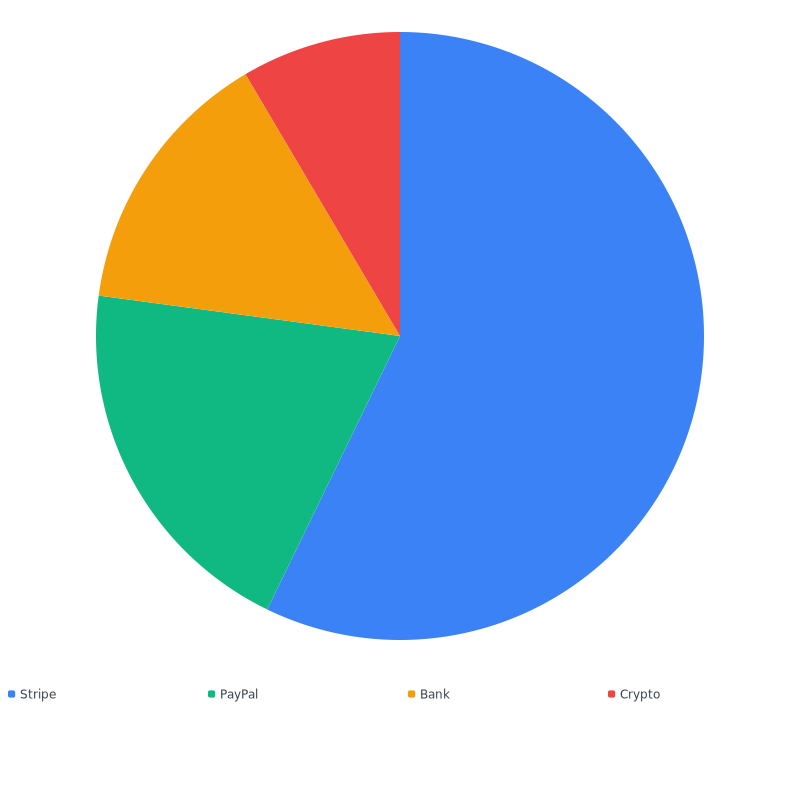
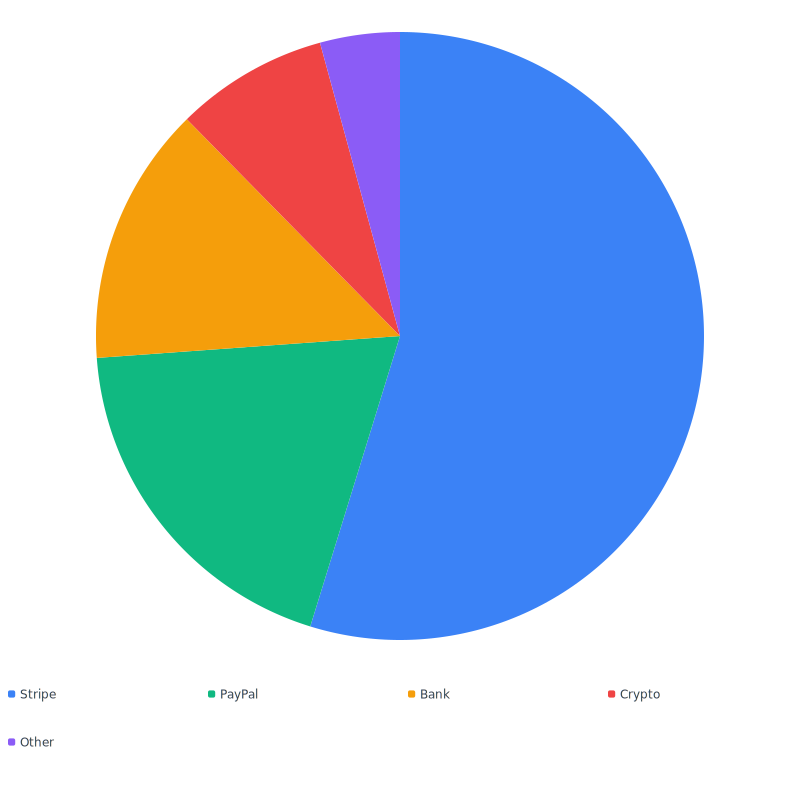
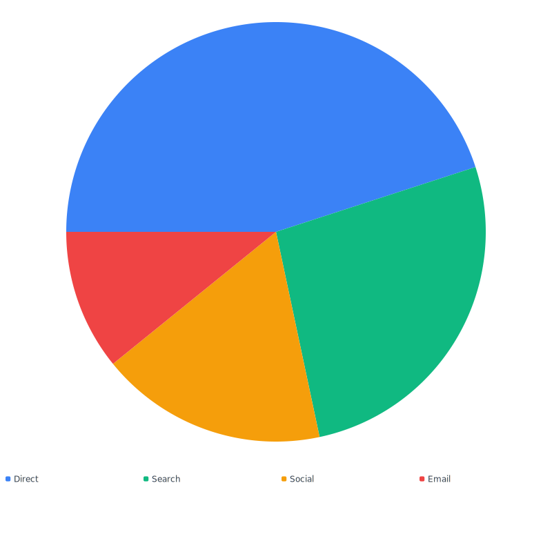
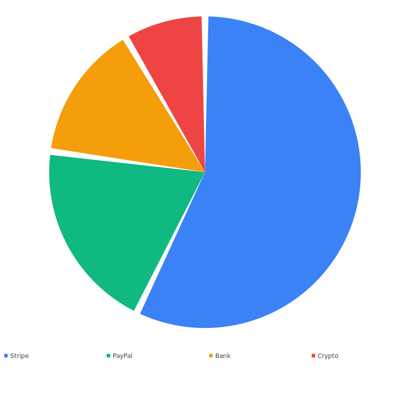

# Pie

Standard pie chart with optional legend, slice gaps, and rotation.


## Quickstart

```php
use Noeka\Svgraph\Chart;

echo Chart::pie([
    'Stripe' => 1240,
    'PayPal' => 432,
    'Bank'   => 312,
    'Crypto' => 184,
])->legend();
```



## Accepted data

Pie charts use `Slice::listFrom()` — see [Data formats](../data-formats.md)
for the full list. The most useful shapes:

- `['Stripe' => 1240, 'PayPal' => 432]` — label => value map
- `[['Stripe', 1240], ['PayPal', 432, '#10b981']]` — tuples with optional color
- `[new Slice('Stripe', 1240, '#10b981')]` — explicit `Slice` objects

Tuples with fewer than two elements throw `InvalidArgumentException` at
construction time.

## Options

| Method | Default | Description |
|--------|---------|-------------|
| `->data($data)` | `[]` | Set the slices. |
| `->thickness(float)` | `0.0` | Donut thickness as a fraction of outer radius. `0.0` = solid pie, `0.95` = hairline. Clamped to 0.0–0.95. |
| `->gap(float degrees)` | `0.0` | Padding between slices, in degrees. |
| `->startAngle(float degrees)` | `0.0` | Rotation offset clockwise from 12 o'clock. |
| `->legend(bool = true)` | `false` | Render a color-swatch legend below the chart. |
| `->aspect(float)` | `1.0` | Width-to-height ratio. |
| `->cssClass(?string)` | `null` | Extra class on the wrapper. |
| `->theme(Theme)` | `Theme::default()` | Theme tokens. |
| `->animate(bool = true)` | `false` | Slices sweep in via `stroke-dasharray`. |

## With legend

The legend wraps under the chart, picking up the same colors used for
the slices.

```php
Chart::pie([
    'Stripe' => 1240,
    'PayPal' => 432,
    'Bank'   => 312,
    'Crypto' => 184,
    'Other'  => 96,
])->legend();
```



## Custom rotation (`startAngle`)

Pass a value in degrees clockwise from 12 o'clock. Negative values
rotate counter-clockwise.

```php
Chart::pie([
    'Direct'  => 540,
    'Search'  => 320,
    'Social'  => 210,
    'Email'   => 130,
])->startAngle(-90)->legend();
```



## Slice gap

`gap()` adds padding between slices, in degrees. Useful for a more
"infographic" look.

```php
Chart::pie([
    'Stripe' => 1240,
    'PayPal' => 432,
    'Bank'   => 312,
    'Crypto' => 184,
])->gap(2.5)->legend();
```



## Color resolution

For each slice, the package picks a color in this order:

1. The `Slice` instance's `color`.
2. The theme palette at `index % count(palette)`.

There is no chart-level color shortcut for pie charts — colors are
slice-by-slice, not chart-wide.

## Notes

- Slices with non-positive values (zero, negative, or non-finite) are
  silently skipped.
- A pie consisting of a single slice is rendered as a complete circle
  (no arc math edge cases).
- The aspect ratio is square (`1.0`) by default. Increase it (e.g.
  `->aspect(1.4)`) to give a long horizontal legend more horizontal
  room.
- A `gap()` larger than the slice's sweep angle silently skips that
  slice.

## Related

- [Donut](donut.md) — same surface, plus `thickness()`
- [Theming](../theming.md)
- [Animations](../animations.md)
- [Accessibility](../accessibility.md)
