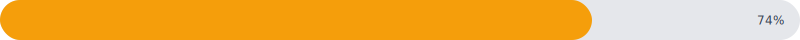
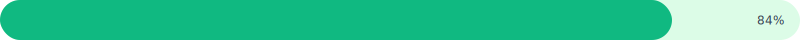

# Progress

A horizontal progress indicator showing a value against a target.
Useful for goal tracking, capacity meters, KPI summaries.


## Quickstart

```php
use Noeka\Svgraph\Chart;

echo Chart::progress(value: 7400, target: 10000)
    ->color('#f59e0b')
    ->showValue();
```



## Constructor

Progress charts take two scalars at construction time, not a series:

```php
Chart::progress(value: 7400, target: 10000);
// or positional:
Chart::progress(7400, 10000);
```

You can also adjust them later:

```php
$chart->value(7400)->target(10000);
```

The fraction is clamped to `[0.0, 1.0]` when `target > 0`. A `target`
of `0` (or negative) renders an empty bar.

## Options

| Method | Default | Description |
|--------|---------|-------------|
| `->value(float)` | constructor | Update the value after construction. |
| `->target(float)` | `100.0` | Update the target after construction. |
| `->color(string)` | theme fill | Fill color of the progress bar. |
| `->trackColor(string)` | theme track | Background color of the unfilled track. |
| `->rounded(float percent)` | `50.0` | Corner radius as a percentage of bar height. `0` = square, `50` = fully rounded. Clamped to 0–50. |
| `->showValue(bool = true, ?label = null)` | off | Show a percentage label beside the bar. Pass an explicit `$label` to override the auto-formatted percentage. |
| `->aspect(float)` | `20.0` | Width-to-height ratio. |
| `->cssClass(?string)` | `null` | Extra class on the wrapper. |
| `->theme(Theme)` | `Theme::default()` | Theme tokens. |
| `->animate(bool = true)` | (no-op) | Progress charts have no entrance animation; the flag is accepted but ignored. |

## Custom track color

Pair the bar color with a tinted track for a softer look.

```php
Chart::progress(value: 4200, target: 5000)
    ->color('#10b981')
    ->trackColor('#dcfce7')
    ->rounded(50)
    ->showValue();
```



## Custom value label

`showValue()` defaults to a rounded percentage (`74%`). Pass an
explicit string to render any label you like.

```php
Chart::progress(value: 12, target: 20)
    ->color('#3b82f6')
    ->showValue(label: '12 of 20 done');
```


## Notes

- The chart renders a rounded `<rect>` for the track and (if value > 0)
  a second `<rect>` for the filled portion. Both share the same
  rounding from `rounded()`.
- The default 20:1 aspect makes the bar visually thin. Reduce the
  ratio (`->aspect(8)`) for a chunkier bar.
- The hover/focus tooltip shows formatted `value / target` (e.g.
  `7,400 / 10,000`).
- Animations are not implemented for progress charts. Calling
  `->animate()` is a no-op.

## Related

- [Theming](../theming.md)
- [Accessibility](../accessibility.md)
