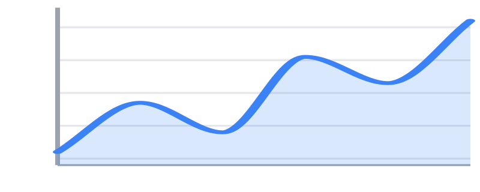
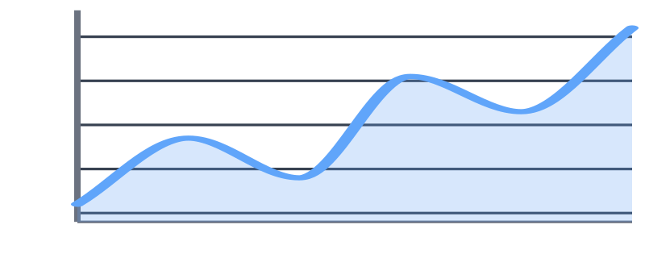
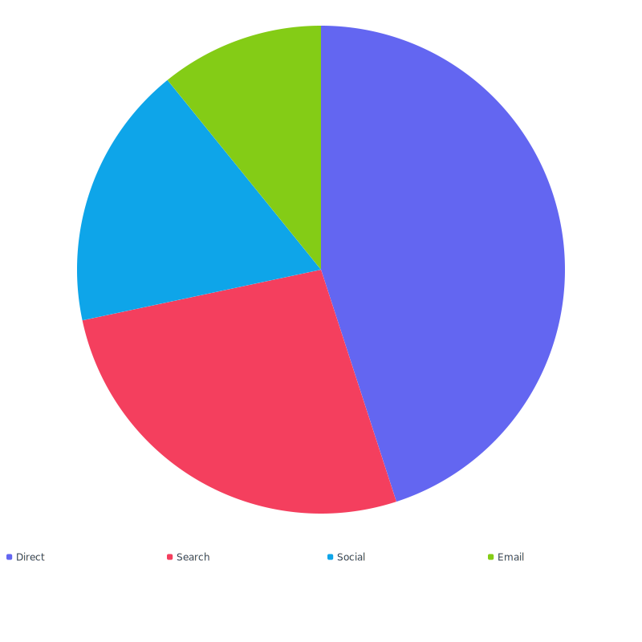

# Theming

All charts use `Theme::default()` out of the box. You can pass a built-in
theme, modify one with the `with*()` helpers, or construct one from
scratch.



## Built-in themes

### `Theme::default()`

Light backgrounds, mid-saturation palette, gray axes/grid.

```php
Chart::line($data)->theme(Theme::default());
```

### `Theme::dark()`

Tuned for dark UI surfaces — brighter palette, dark grid lines, light text.

```php
Chart::line($data)->theme(Theme::dark());
```



## Modifying a theme

Themes are immutable (`readonly`) — every modifier returns a new instance.

### `withPalette(...colors)`

Replace the multi-series / partition palette.

```php
Chart::pie($data)->theme(
    Theme::default()->withPalette('#6366f1', '#f43f5e', '#0ea5e9', '#84cc16'),
)->legend();
```



### `withTooltip($background, $textColor, $borderRadius)`

Restyle the CSS hover tooltip. All three arguments are nullable — pass
only what you want to change.

```php
Theme::default()->withTooltip(background: '#0f172a', textColor: '#f8fafc');
```

### `withHover($brightness, $strokeWidth, $piePopDistance)`

Tune the hover/focus highlight. `brightness` is a number passed to CSS
`filter: brightness()`; `strokeWidth` adds extra stroke on hover;
`piePopDistance` is the distance pie/donut slices pop outward.

```php
Theme::default()->withHover(brightness: '1.3', piePopDistance: '6px');
```

### `withAnimation($duration, $easing)`

Override the entrance-animation timing (only affects charts with
`->animate()` enabled).

```php
Theme::default()->withAnimation('0.4s', 'cubic-bezier(0.4,0,0.2,1)');
```

## Building a theme from scratch

```php
use Noeka\Svgraph\Theme;

$theme = new Theme(
    palette:     ['#6366f1', '#f43f5e', '#0ea5e9'],
    stroke:      '#6366f1',
    strokeWidth: 2.0,
    fill:        '#6366f1',
    textColor:   '#1e293b',
    fontFamily:  'inherit',
    fontSize:    '0.75rem',
    gridColor:   '#e2e8f0',
    axisColor:   '#94a3b8',
    trackColor:  '#e2e8f0',
);
```

## Full theme reference

| Constructor parameter | CSS exposure | Description |
|-----------------------|--------------|-------------|
| `palette: list<string>` | — | Colors used in order for multi-series and partition charts. |
| `stroke: string` | — | Default stroke color for lines and axes. |
| `strokeWidth: float` | — | Default stroke width for lines (in viewBox units). |
| `fill: string` | — | Default fill color (e.g. for bars when no `->color()` set). |
| `textColor: string` | — | Color for axis labels, legend text, and value labels. |
| `fontFamily: string` | — | Label font family; `'inherit'` picks up the host page. |
| `fontSize: string` | — | CSS length such as `'0.75rem'`. |
| `gridColor: string` | — | Color for grid lines. |
| `axisColor: string` | — | Color for axis lines. |
| `trackColor: string` | — | Background for progress track and donut "empty" portion. |
| `tooltipBackground: string` | `--svgraph-tt-bg` | Tooltip panel background. |
| `tooltipTextColor: string` | `--svgraph-tt-fg` | Tooltip text color. |
| `tooltipBorderRadius: string` | `--svgraph-tt-r` | Tooltip corner radius (CSS length). |
| `hoverBrightness: string` | `--svgraph-hover-brightness` | Number passed to `filter: brightness()` on hover. |
| `hoverStrokeWidth: string` | `--svgraph-hover-stroke-width` | Extra stroke width added on hover. |
| `piePopDistance: string` | `--svgraph-pie-pop-distance` | CSS length pie/donut slices pop outward by on hover. |
| `animationDuration: string` | `--svgraph-anim-dur` | CSS time for entrance animations. |
| `animationEasing: string` | `--svgraph-anim-ease` | CSS easing function for entrance animations. |

The CSS-exposed values are emitted as custom properties on the chart
wrapper, so you can also override them from your own stylesheet — see
[CSS customization](css-customization.md).

## Default values

`Theme::default()` uses the following palette and colors:

```
palette:     #3b82f6  #10b981  #f59e0b  #ef4444
             #8b5cf6  #ec4899  #14b8a6  #f97316
stroke:      #3b82f6
strokeWidth: 2.0
fill:        #3b82f6
textColor:   #374151
gridColor:   #e5e7eb
axisColor:   #9ca3af
trackColor:  #e5e7eb
```

`Theme::dark()` uses a brighter palette plus dark grid/axis colors and
light text — see `src/Theme.php` for the exact values.

## Per-series color override

Even with a theme set, individual series and slices can pin their own
color:

```php
Series::of('Costs', $data, '#ef4444');  // overrides palette colour
new Slice('Stripe', 1240, '#10b981');   // overrides palette colour
```

A single-series chart's `->stroke()`/`->color()` shortcut also overrides
the palette for that one series.
